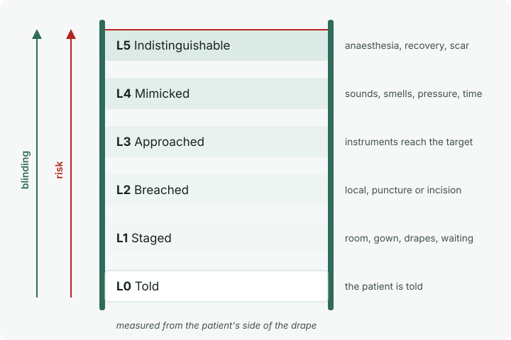

# The Sham Fidelity Ladder

SLOP8814 · Round 4 · Lecture

---

"Every sham is a list of things the patient must not be able to tell."

---

The question: how much of an operation do you have to perform in order not
to perform it?

---

## L0 Told

The patient is told. Nothing else happens. The floor.

---

## L1 Staged

Room, gown, monitoring, drapes, waiting. No skin breached.

---

## L2 Breached

Local anaesthetic, a puncture, an incision. Nothing deeper.

---

## L3 Approached

Instruments reach towards the target and stop.

---

## L4 Mimicked

L3 plus the sounds, smells, pressures and duration of the real thing.

---

## L5 Indistinguishable

L4 plus matched anaesthesia, recovery, dressing, scar, and a scripted team.

---

Measured from the patient's side of the drape.

---

Placing a trial: Buchbinder 2009 — a needle resting on bone, the vertebra
tapped, the cement mixed in the room so it could be smelled. Where does it
sit?

Our provisional answer: L4. Argue.

---

Placing a trial: ORBITA — sedation, headphones, the same laboratory, the
same time on the table.

Provisional: L5. Note that both arms had angiography.

---

{/* _class: impact */}

"Every rung up buys blinding with risk."

---

In the Round: rate the five. Record disagreements. Write §4.

---

Next: Round 5 — four channels of blinding.
